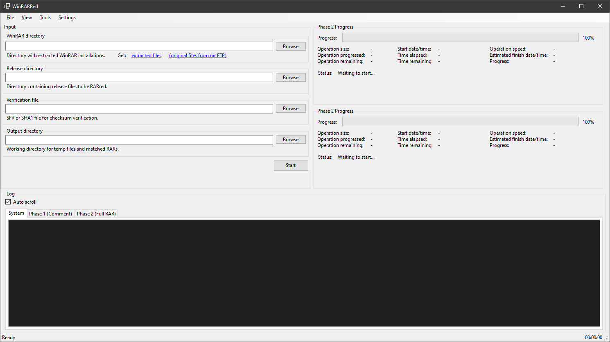

# WinRARRed

WinRARRed is a Windows utility that brute-forces WinRAR command line settings to recreate a bit-perfect RAR archive from its extracted files. It is aimed at preservation workflows where the original archive is missing but the payload files (and a verification hash) are intact.



## How it works

1. Copies the release into a scratch folder (recreated on each run).
2. Iterates over each `rar.exe` under a WinRAR versions root, filtered by the selected version range.
3. Generates archives for each switch combination.
4. Calculates CRC32 or SHA1 and compares it to the verification file.
5. When a match is found, the archive is kept and reported.

An optional **two-phase** approach speeds things up dramatically:

- **Phase 1** tests only the CMT (comment) block against each RAR version. This is fast because the data is tiny.
- **Phase 2** runs the full RAR creation with only the versions that matched in Phase 1.

## Features

- Brute-force across multiple WinRAR versions (2.x through 7.x) and archive formats (RAR4 via `-ma4`, RAR5 via `-ma5`, RAR7 native).
- Switch matrix support: compression level, dictionary size, solid on/off, recursion, timestamp flags, volume sizing, and `-mt` thread counts.
- File attribute toggling (Archive, NotContentIndexed) or `-ai` to ignore attributes.
- Header patching: automatically patches Host OS, file attributes, LARGE flag (64-bit sizes), CMT service block fields, and End of Archive block to match original values from SRR. Recalculates header CRCs after each patch.
- SRR import to prefill settings and verify input files.
- Multi-volume handling for `.partXX.rar` and legacy `.r00` naming.
- Logging to disk (app logs + per-attempt logs).
- Optional cleanup of non-matching archives to control disk usage.
- Rename matched output files to original volume names from SRR.

### File Inspector

A built-in binary inspector for RAR and SRR files with:

- Tree view of all header blocks (signature, archive header, file headers, service blocks, end of archive).
- Property list showing every field in byte order with hex values and decoded descriptions.
- Hex view with highlighting: selecting a field highlights its bytes; selecting a byte highlights the owning field.
- Full RAR 4.x and RAR 5.x support, including extra area records (encryption, file hash, timestamps, locator, metadata, redirection, unix owner) and data areas (stored/compressed comment text).
- SRR block inspection with correct offset tracking for all block types (SRR header, stored files, RAR file references, OSO hashes, RAR padding).
- Drag-and-drop file opening.
- Tree filtering to search blocks by name.
- Export of raw block data via context menu.

### File Compare

Side-by-side comparison of two RAR or SRR files. Parses both files with the detailed header parser and shows matching/differing fields with color-coded highlighting.

## Requirements

- Windows 10/11.
- .NET 8.0 runtime.
- A folder of WinRAR builds, each in its own subdirectory containing `rar.exe`.
  The folder name must include version digits (examples: `winrar-x64-400`, `rar-550`, `winrar-x64-700`).
  - [Extracted files](https://drive.google.com/file/d/1of053kS2Wxk-foHN_ALRu-u6Tcck58yn/view?usp=drive_link) — pre-extracted `rar.exe` binaries ready to use.
  - [Original files from rar FTP](https://drive.google.com/file/d/1hvgzSY6YH_ZS3cpy7bHcw2zpjiwuP_Xi/view?usp=drive_link) — original installer archives.
- The release directory with uncompressed files (must be unmodified).
- A verification file: `.sfv` (CRC32) or `.sha1`.

## Usage

1. Select the WinRAR versions folder.
2. Select the release folder.
3. Select the verification file (`.sfv` or `.sha1`).
4. Pick a temporary output folder (SSD recommended).
5. Open Options to select versions and switch families; optionally import an `.srr`.
6. Start the brute-force run.

Outputs:
- Scratch folders are created under the chosen output path:
  - `input` (copied release files)
  - `output` (generated archives)
  - `logs` (per-attempt RAR output)
- If a match is found, the matching archive is saved as `<ReleaseName>.rar` in the output folder.
- App logs are written to `logs` next to the executable.
- If "Delete RAR files" is disabled, `output` keeps the first volume of non-matching attempts.

## SRR import

Use `Options -> Import SRR` to apply metadata from an `.srr`:
- Archive file list and CRC32s (used to validate copied input files).
- Compression method and dictionary size.
- Solid/archive and multi-volume flags plus volume sizing when detectable.
- Candidate RAR version range based on SRR headers (RAR4, RAR5, or RAR7).
- Host OS, file attributes, LARGE flag, and CMT block fields for post-creation patching.
- Stored `.sfv` extraction to `%TEMP%\WinRARRed\srr-import\...` when present.
- Custom packer detection (RELOADED, HI2U, QCF).

## RAR version support

| Version Range | Archive Format | Notes |
|---------------|----------------|-------|
| 2.x | RAR4 | Basic compression |
| 3.x | RAR4 | Timestamp options from 3.20+, CMT service blocks |
| 4.x | RAR4 | Full feature set |
| 5.x | RAR4 or RAR5 | Defaults to RAR5 from 5.50+; use `-ma4` for RAR4 |
| 6.x | RAR4 or RAR5 | Known issue: ignores `-tsc0`/`-tsa0` for RAR4 format |
| 7.x | RAR7 only | Cannot create RAR4/RAR5; drops `-ma4`/`-ma5`/`-vn` flags |

## Project structure

```
WinRARRed/
├── RARLib/                     # RAR format library (no UI dependencies)
│   ├── Decompression/          # Native LZSS + PPMd decompressors
│   │   └── PPMd/               # PPMd model, range coder, allocator
│   ├── RARHeaderReader.cs      # RAR 4.x header parsing
│   ├── RAR5HeaderReader.cs     # RAR 5.x header parsing
│   ├── RARDetailedHeader.cs    # Detailed per-field parsing with byte offsets
│   ├── RARPatcher.cs           # Post-creation header patching (Host OS, attrs, LARGE, CRC)
│   ├── RARFileHeader.cs        # Parsed header data structures
│   ├── RARFlags.cs             # Flag enums (archive, file, end-archive, timestamp precision)
│   └── RARUtils.cs             # CRC, date conversion, filename decoding
│
├── SRRLib/                     # SRR format library (depends on RARLib)
│   ├── SRRFile.cs              # Main parser — extracts RAR headers, comments, timestamps, CRCs
│   └── SRRBlock.cs             # Block type definitions and data classes
│
├── WinRARRed/                  # Main GUI application
│   ├── Forms/                  # Windows Forms
│   │   ├── MainForm.cs         # Main window, file selection, log display
│   │   ├── SettingsOptionsForm.cs  # Brute-force options, SRR import, version selection
│   │   ├── FileInspectorForm.cs    # RAR/SRR binary inspector with hex view
│   │   └── FileCompareForm.cs      # Side-by-side file comparison
│   ├── Controls/               # Custom controls
│   │   ├── HexViewControl.cs   # Virtualized hex viewer with field highlighting
│   │   └── OperationProgressStatusUserControl.cs  # Progress bar with time estimates
│   ├── Diagnostics/            # Process management
│   │   ├── RARProcess.cs       # CliWrap wrapper for rar.exe
│   │   ├── RARArchiveVersion.cs    # RAR4/RAR5/RAR7 flags enum
│   │   └── RARCommandLineArgument.cs  # Version-constrained switch
│   ├── IO/                     # File I/O (SFV, SHA1 parsing, extraction)
│   ├── Cryptography/           # CRC32, SHA1 hashing
│   ├── Manager.cs              # Core brute-force orchestration (two-phase, patching)
│   ├── RAROptions.cs           # Configuration options (patching, naming, attributes)
│   ├── BruteForceOptions.cs    # Per-run options (paths, hashes)
│   └── docs/                   # Technical documentation
│
├── RARLib.Tests/               # xUnit tests for RARLib (176 tests)
└── SRRLib.Tests/               # xUnit tests for SRRLib (49 tests)
```

## Build

```bash
# Build
dotnet build WinRARRed/WinRARRed.csproj

# Run
dotnet run --project WinRARRed/WinRARRed.csproj

# Build release
dotnet publish WinRARRed/WinRARRed.csproj -c Release

# Run tests
dotnet test RARLib.Tests/RARLib.Tests.csproj
dotnet test SRRLib.Tests/SRRLib.Tests.csproj
```

## Dependencies

| Package | Version | Purpose |
|---------|---------|---------|
| Crc32.NET | 1.2.0 | CRC32 calculation |
| CliWrap | 3.10.0 | Process execution wrapper |
| SharpCompress | 0.33.0 | RAR extraction (backup) |
| Serilog | 4.2.0 | Structured logging |

## License

MIT - see [LICENSE](LICENSE).
